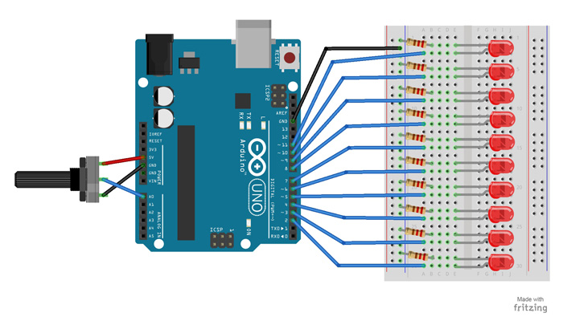

# Bar Graph
Using a potentiometer, you can control a series of LEDs in a row.  Turning the potentiometer knob will turn on or off more of the LEDs.

### Parts Needed

- (1) Arduino Uno
- (1) USB A-to-B Cable
- (1) Breadboard – Half Size
- (1) Potentiometer – Rotary
- (10) LED 5mm
- (10) 220 Ω Resistor
- (11) Jumper Wires

### Circuit Diagram

